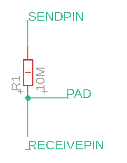

# FastCapacitiveSensor

## Introduction

This library for Arduino enable you to use capacitive sensors. This library is faster than any other libraries before.

## Software requirement

This library uses math.h.

## Hardware requirement



The resistor decide the time of charging. receivePin must be analog input pin.

## How it works

### Basic construction

Capacitive sensors are pseudo capacitors. Your Arduino will measure the time of charging them, and if the time is long, it decides that a conductor touching on the sensor.

### How to sense faster

The equation of the sensed voltage will be:
$$
V = V_0(1-e^{-\frac{1}{RC}t})
$$
In this library, the time when $V=0.9V_0$ in units of micro seconds will return.

Actually, we do not have to measure the time until $V$ gets $0.9V_0$. When the time is $t_1$, this library quit timing and sense the voltage $V_1$.

The expected returning time $t_{pre}$ will calculated:
$$
t_{pre} = \frac{\log(1 - 0.9)}{\log(1 - \frac{V_1}{V_0})}t_1
$$

## Usage

See also example program.

### Include

```c++
#include <FastCapacitiveSensor.h>
```

### Define a class

```c++
FastCapacitiveSensor sensor1;
```

### Execute begin function

```c++
sensor1.begin(A0, A1, 5.0, 10, 10, 0.2);
```

arguments:

```c++
void begin(sendPin, receivePin, maxVoltage, frequency, breakThreshold, excludeRatio);
```

maxVoltage is the voltage of the sendPin. It is $V_0$.

frequency is how many times the touch function tries sensing.

breakThreshold is the threshold of breaking sensing. The unit is micro seconds. the touch function finish sensing on the breakThreshold time, and after that, calculate the expected time of sensing. It is $t_1$.

excludeRatio is the ratio of exclusion of sensed values. Must be larger than or the same as 0 and smaller than 0.5.

### Sense

```c++
sensor1.touch()
```

The return value is the sensed (or calculated) time in units of micro seconds. The type is double.